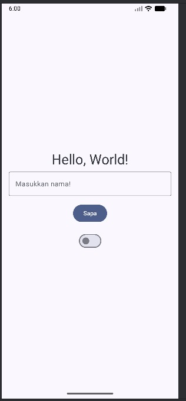
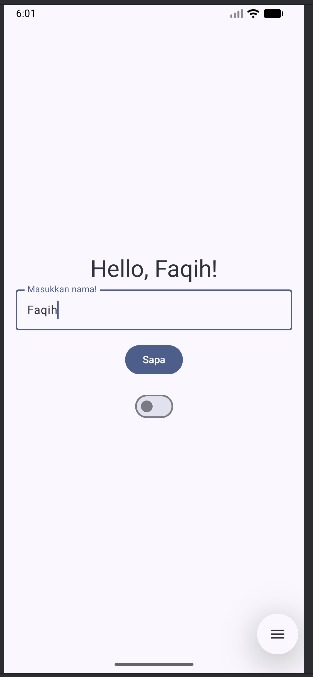
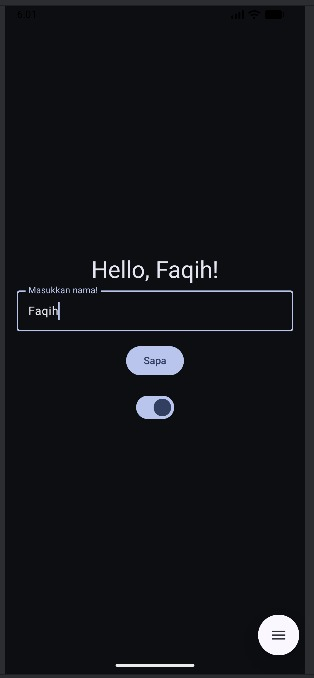

# HelloUI
### tugas 1 pemrograman mobile

> Nama: Muhammad Azma Al Faqih
> Nim: 2410817110008

## about
Aplikasi mobile yang akan menyapa user dengan teks berdasarkan input user dengan toggle dark mode sederhana

## how to run
1. clone repository pada terminal/cmd
```bash
git clone https://github.com/Ryuzora/HelloUI.git
```

2. Buka folder repo yang telah diclone dengan android studio

3. pada android studio, lakukan run dengan menekan tombol ▶️ pada bagian atas atau bisa juga dengan menekan tombol Shift+F10

4. Aplikasi berhasil dijalankan

## images



